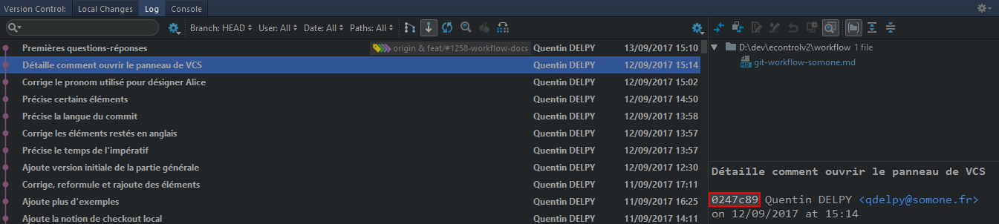
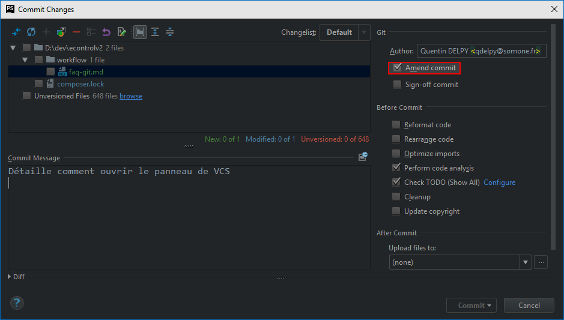
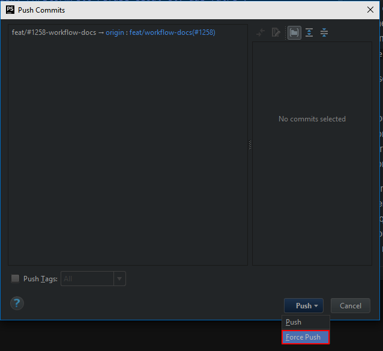

# Foire aux questions Git

Cette FAQ est un _WIP_, n'hésitez pas à communiquer sur le repo des questions
que vous pouvez avoir afin d'avoir des réponses ici.

Sinon, n'hésitez pas à la faire vivre si vous avez des questions dont vous
avez trouvé la réponse, pour aider tout le monde !

## Que faire pour changer de branche sans perdre des modifs locales ?

Lorsque vous changer de branche `git checkout {BRANCHE}` ou via le panneau
des branches git PHPStorm :

PHPStorm peut parfois vous signaler que certains changements qui n'ont pas été
commit posent problème. Soit vous ne souhaitez pas garder **du tout** ces
changements via le bouton `Force checkout` ou vous souhaitez les garder et
les appliquer sur la branche de destination via `Smart checkout`.

#### Que fait `Smart checkout` ?

`Smart checkout` permet de `stash`, `checkout` puis `stash pop`.
* `stash` permet garder sur une branche cachée des modifications qui n'ont pas
été `commit`.
* `checkout` permet de changer le pointeur interne de Git. Dans notre exemple,
on change de branche
* `stash pop`, appelé par PHPStorm _unstash_, permet d'enlever le dernier
élément qui a été `stash` et appliquer ses changements à l'espace de travail
actuel

#### Comment ne pas appliquer mes changements à la branche vers laquelle je vais ?

Il existe plusieurs façon de le faire, notamment, en faisant un commit.

_Cependant, cette méthode ne sera pas décrite ici. Ce sera sûrement le sujet
d'une autre question si besoin_

Vous pouvez utiliser `git stash` pour garder une copie dans la _stash_ de
vos modifications.

Une fois que vous vous trouvez dans la branche ou l'espace de travail où
vous souhaitez avoir les changements qui ont été `stash`, vous faites
`git stash pop` pour prendre le dernier élément et l'enlever de la stash.

## Comment obtenir le _hash_ d'un commit ?

Dans le panneau de log de PHPStorm :

Ou avec `git log --oneline`, les 8 premiers caractères d'un commit

## Comment bouger des commits d'une branche vers une autre ?

_**Attention!** Il ne faut surtout pas essayer cette méthode si les commits
ont déjà été push sur le repo ! Cette méthode change l'historique._

Cela peut arriver notamment si vous vous trouvez à faire des commits en
direct sur une branche dite _historique_ ou de longue durée (`dev` ou
`master` :o) pour x raison et que vous vous apercevez que ce serait mieux
de le faire sur une feature-branch, notamment si le problème que vous cherchez
à résoudre est plus complexe que prévu et peut prendre plusieurs commits.

Dans ce cas, créez une nouvelle branche, basée sur la branche où résident
les commits à déplacer.

CLI : `git branch {NOM_NOUVELLE_BRANCHE} {NOM_ANCIENNE_BRANCHE}`

Vous devez ensuite reset la branche sur laquelle vous étiez (pas la nouvelle
branche) au dernier commit qui doit effectivement résider dans la branche.

Pour cela, il faut ouvrir le panneau de `Version Control` > Log puis
ouvrir le menu contextuel du commit qui décrit l'état où on veut revenir
puis `Reset current branch to here...` et `Hard`

En CLI, il faut connaitre le hash du commit ou sa position depuis le dernier commit.
Par exemple, si l'on veut revenir à l'état 3 commits auparavant :
`git reset --hard HEAD~3`. Si son _hash_ était de `a1b5ds5s` alors :
`git reset --hard a1b5ds5s`

Vous avez maintenant la branche initiale qui est revenu à l'état voulu et la
branche créé qui a gardé les commits rajoutés.

## Comment modifier le commit précédent ?

Avec la commande `git commit --amend` ou, dans PHPStorm :

Vous pouvez changer le message du commit, son auteur, les fichiers modifiés
et les modifications. Bref, vous pouvez totalement changer le commit précédent.

**Attention** : cette commande change l'historique (elle utilise `rebase`
en interne). Ne **PAS** pusher des commits modifiés avec cette commande sauf
si il est certain que personne n'a récupéré votre branche.

## Lors d'un push, PHPStorm/Git refuse celui-ci, que faire ?

Si des commits sont refusés lors d'un push, c'est que le repo distant a
_divergé_ du repo local.

Cela signifie par exemple que quelqu'un a rajouté des commits depuis le
dernier `pull` et qu'un commit local a été fait entre temps.
Il peut aussi arriver que l'intégrité des commits n'est plus la même entre le
repo distant et le local.
Cela arrive notamment lorsque l'on change l'historique via `rebase` (expliqué ici).

Deux solutions :
* Si l'on est dans le 1er cas, alors PHPStorm nous proposera de `merge`
ceux-ci avant de continuer.
Acceptez et vos commits devraient être push correctement. Sinon, résolvez
les conflits éventuels.

* Sinon, il faut d'abord être **CERTAIN** que personne d'autre n'a récupéré
la branche sur laquelle vous travaillez. Si c'est le cas, vous pouvez faire
adopter votre nouvel historique sur le repo distant en faisant un
`push --force`.

